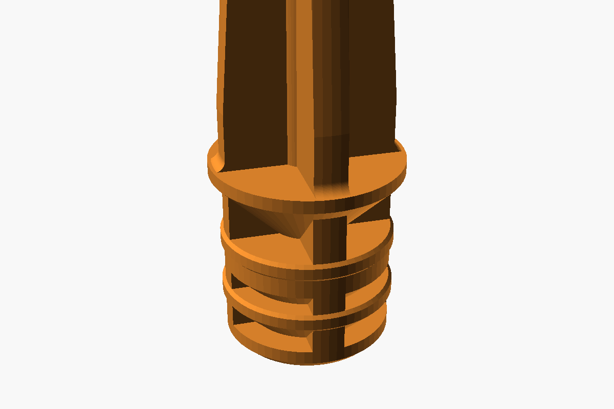
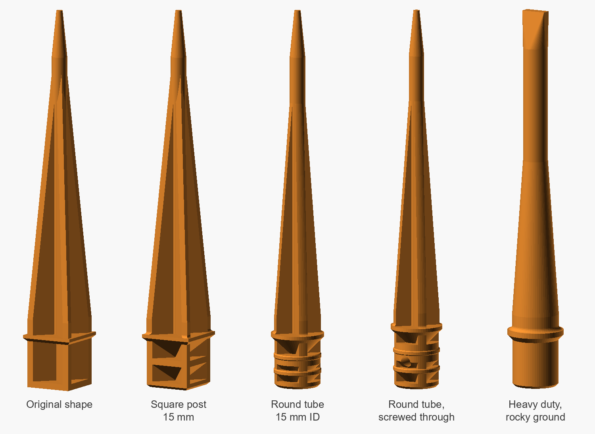
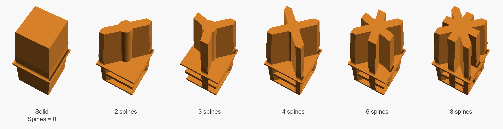
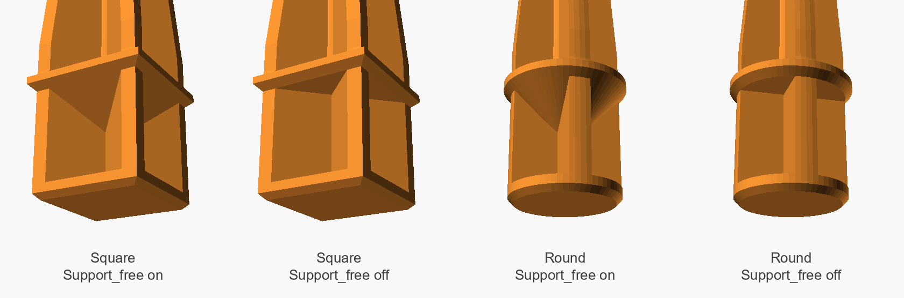
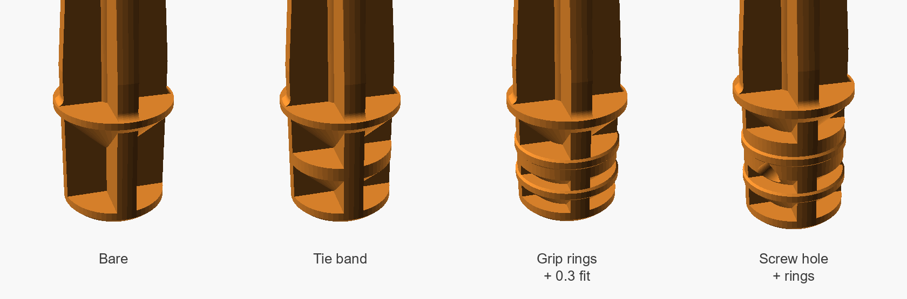
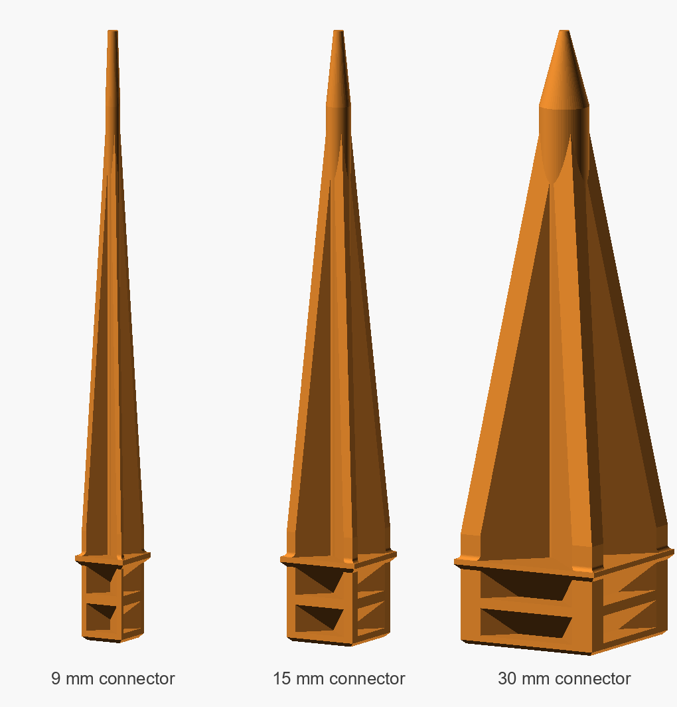
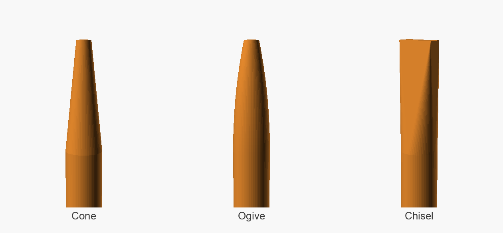

# Configurable Yard Spike

[](LICENSE)
[](https://openscad.org/downloads.html)
[](https://github.com/BelfrySCAD/BOSL2)

A parametric ground spike for OpenSCAD. Plugs into a square post or round tubing, prints standing up, and with one checkbox has **zero faces overhanging past 45 degrees** so it needs no supports and lays no bridges.



```
yard-spike-parametric.scad   the model
yard-spike-parametric.json   five saved presets, auto-loaded by OpenSCAD
tools/verify.py              renders every configuration and measures the mesh
tools/render_images.py       regenerates the pictures in docs/
docs/                        images used by this README, plus a gallery of variants
LICENSE                      CC BY-NC 4.0
```

The `.scad` and `.json` have to share a stem. That is how OpenSCAD finds the presets, so if you rename one, rename both.

---

## Contents

- [What it makes](#what-it-makes)
- [Gallery](#gallery)
- [Quick start](#quick-start)
- [Requirements](#requirements)
- [Presets](#presets)
- [Parameters](#parameters)
- [Support free mode](#support-free-mode)
- [Printing](#printing)
- [Sizing it to your tube](#sizing-it-to-your-tube)
- [Design notes](#design-notes)
- [How this model is verified](#how-this-model-is-verified)
- [Troubleshooting](#troubleshooting)
- [Contributing](#contributing)
- [License and attribution](#license-and-attribution)
- [Changelog](#changelog)

---

## What it makes

A spike that drives into soil, with a connector on the other end that plugs into whatever you are staking down: a sign post, a solar light stem, a garden marker, a length of tubing.

- **Square or round connector**, one dropdown. The collar, the spike base and the taper all follow.
- **2 to 16 spines**, or zero for a solid spike. Thickness, count and clock angle are all yours.
- **Three tip profiles.** Cone, ogive, chisel.
- **Retention hardware.** Tie band, grip rings, and a cross hole for a screw through the tube wall.
- **Support free mode.** Ramps the flutes closed under every horizontal plate so nothing bridges.
- **Guard rails.** Every bad input combination fails with a sentence you can read, not a library assertion.



---

## Gallery

Every picture here is rendered from the current `.scad` by `tools/render_images.py`, so none of them can drift from what the model actually makes.

**Spine count.** Cut off 30 mm up to show the cross section. `Spines = 0` gives a solid taper; 2 to 8 is the useful range.



**Support free mode, seen from below.** With it on, a 45° ramp closes each flute under the collar. With it off, the collar spans the open flutes and the printer has to bridge them.



**Retention hardware.** A tie band across the middle of the connector, grip rings that bite the tube wall, and a teardrop screw hole through the band.



**Size.** 9, 15 and 30 mm connectors at the same scale, everything else at its default. The core, spine thickness and taper all follow `Connector_size`.



**Tip profiles** are compared under [design notes](#tip-profiles), and there is a close-up of each preset's connector end in [`docs/gallery/`](docs/gallery/).

---

## Quick start

### OpenSCAD desktop

```bash
git clone https://github.com/prisant-labs/3d-yard-spike-parametric-openscad.git
cd 3d-yard-spike-parametric-openscad
openscad yard-spike-parametric.scad
```

Open **Window > Customizer**, pick a preset from the dropdown, adjust, then F6 and export STL.

### Command line

Straight to STL from a preset:

```bash
openscad -o spike.stl \
  -p yard-spike-parametric.json \
  -P "Round tube 15 mm ID" \
  yard-spike-parametric.scad
```

Or override single values without touching the file:

```bash
openscad -o spike.stl \
  -D 'Connector_shape="circle"' -D Connector_size=19 -D Fit_clearance=0.35 \
  yard-spike-parametric.scad
```

`-D` values are OpenSCAD expressions, so strings keep their double quotes inside the shell quotes.

Be careful mixing a preset with `-D`. OpenSCAD 2021.01 applies the preset last, so it silently overrides a `-D` for the same parameter; newer snapshots let `-D` win. Use one or the other, or copy a preset's values into `-D` flags.

On Windows, call `openscad.com` rather than `openscad.exe` so messages print to the console, and in PowerShell join the lines or swap the trailing `\` for a backtick:

```powershell
& "C:\Program Files\OpenSCAD\openscad.com" -o spike.stl -p yard-spike-parametric.json -P "Round tube 15 mm ID" yard-spike-parametric.scad
```

### MakerWorld Parametric Model Maker

Upload the `.scad`, and PMM builds the customizer UI from the same parameter comments. PMM has run the 2021.01 release with BOSL2 preinstalled, and every configuration here is tested on 2021.01.

---

## Requirements

| | |
|---|---|
| OpenSCAD | 2021.01 or newer. Tested on 2021.01 and a 2025.12 development snapshot |
| Library | [BOSL2](https://github.com/BelfrySCAD/BOSL2). Tested against the July 2026 master |
| Tools (optional) | Python 3.8+ with `numpy` for `verify.py`, plus `Pillow` for `render_images.py` |

Install BOSL2 by cloning it into your OpenSCAD library folder:

```bash
# Linux
git clone https://github.com/BelfrySCAD/BOSL2.git ~/.local/share/OpenSCAD/libraries/BOSL2
# macOS
git clone https://github.com/BelfrySCAD/BOSL2.git ~/Documents/OpenSCAD/libraries/BOSL2
# Windows
git clone https://github.com/BelfrySCAD/BOSL2.git %USERPROFILE%\Documents\OpenSCAD\libraries\BOSL2
```

The folder must be named exactly `BOSL2`. **File > Show Library Folder** in OpenSCAD opens the right place if yours is somewhere else.

Rendering speed depends on the geometry engine. The 2021.01 release uses CGAL and takes about 4 seconds for a full render at the default `Roundness`. Newer development snapshots default to the Manifold engine, which does the same job in well under a second. Both produce the same volumes.

---

## Presets

`yard-spike-parametric.json` sits beside the `.scad` and OpenSCAD picks it up automatically when the filenames match. Each preset only lists the values it changes; everything else stays at the defaults in the `.scad`.

| Preset | For | Volume |
|---|---|---|
| **Original shape** | The unmodified classic geometry, bridges and all | 7881 mm³ |
| **Square post 15 mm** | Square post, light slip fit | 8526 mm³ |
| **Round tube 15 mm ID** | Round tubing with grip rings | 6930 mm³ |
| **Round tube, screwed through** | Wind load. Deeper plug, screw hole, rings | 7280 mm³ |
| **Heavy duty, rocky ground** | Solid section, fat core, chisel tip | 11856 mm³ |

Volumes are measured by `tools/verify.py` and match on both geometry engines. For PETG at about 1.27 g/cm³, 1000 mm³ of solid part is roughly 1.3 g, so a stock spike lands around 9 to 11 g before infill savings.

---

## Parameters

### Fit

| Parameter | Default | Range | Notes |
|---|---|---|---|
| `Connector_shape` | `square` | square / circle | Drives the connector, collar, spike base and taper |
| `Connector_size` | 15 | 4 to 120 | Across the flats for square, diameter for round. **Measure the inside of your tube** |
| `Connector_depth` | 15 | 4 to 80 | How far the connector reaches in |
| `Fit_clearance` | 0 | 0 to 3 | Shrinks the connector alone. 0.2 to 0.4 suits most tubing |

### Printing

| Parameter | Default | Range | Notes |
|---|---|---|---|
| `Support_free` | true | checkbox | See [below](#support-free-mode) |
| `Lead_in_chamfer` | 0.8 | 0 to 8 | Entry chamfer on the leading end |
| `End_cap_thickness` | 2 | 0.4 to 15 | Solid pad at the leading end. Bed contact and strike face |
| `Roundness` | 64 | 8 to 256 | Facets on round features |

### Spike

| Parameter | Default | Range | Notes |
|---|---|---|---|
| `Spike_length` | 107 | 24 to 400 | Collar to point, collar included |
| `Spike_base_length` | 5 | 0 to 60 | Straight section before the taper |
| `Spines` | 4 | 0 to 16 | **0 makes it solid.** 2 to 8 is the useful range |
| `Spine_thickness` | 0 | 0 to 30 | 0 works it out from the core. Lands on 2.83 at stock size |
| `Spine_rotation` | 45 | 0 to 360 | 45 puts four spines on the corners of a square connector |
| `Core_diameter` | 0 | 0 to 60 | Central rod. 0 means one third of `Connector_size` |

### Tip

| Parameter | Default | Range | Notes |
|---|---|---|---|
| `Tip_style` | `cone` | cone / ogive / chisel | See [design notes](#tip-profiles) |
| `Tip_length` | 15 | 1 to 90 | Longer is pointier |
| `Tip_diameter` | 2 | 0.4 to 30 | Diameter at the point, or edge thickness for the chisel |

### Grip

| Parameter | Default | Range | Notes |
|---|---|---|---|
| `Tie_band` | true | checkbox | Solid band tying the spines together mid connector |
| `Tie_band_thickness` | 2 | 0.4 to 30 | Grows on its own if it has to carry a screw hole |
| `Grip_rings` | 0 | 0 to 8 | Rings that bite the tube wall |
| `Grip_ring_height` | 0.3 | 0 to 3 | Real interference is this **minus** `Fit_clearance` |
| `Grip_ring_thickness` | 1.6 | 0.4 to 15 | Measured along the spike |
| `Screw_hole` | 0 | 0 to 20 | Cross hole through the tie band. Teardrop, so it prints clean |

### Collar

| Parameter | Default | Range | Notes |
|---|---|---|---|
| `Collar_thickness` | 2 | 0.4 to 20 | May be auto-thickened, see below |
| `Collar_lip` | 1 | 0 to 20 | Overhang past the connector, per side |
| `Collar_fillet` | 1 | 0 to 20 | Fillet into the collar. Highest stress point on the part |

Three conventions worth knowing:

- **`0` means automatic** in `Spine_thickness` and `Core_diameter`.
- **Counts stay integer.** `Spines`, `Grip_rings` and `Roundness` have integer steps. Everything else accepts decimals, which is what the `[min:step:max]` annotations are for. OpenSCAD decides int vs float from the value and step, not from how the number is written, so a bare `15` with no annotation would give you a whole-numbers-only field.
- **The model talks back.** Every render echoes the computed tip angle, spine thickness and core diameter, and says so if it had to thicken the collar. For the defaults that is:

  ```
  ECHO: "Tip included angle: 11.4212 deg   Spine thickness: 2.82843 mm   Core: 5 mm"
  ```

---

## Support free mode

| | `Support_free = true` | `Support_free = false` |
|---|---|---|
| Steepest face on the part | 45.0° | 90° |
| Flat area the printer has to bridge | **0.00 mm²** | 121 mm² per plate on a stock square, 100 mm² round |
| Extra material | about +3% bare, +5 to 7% with tie band and rings | baseline |
| Flutes | ramp closed under each plate | run full length |

The bridged area counts every plate: the collar alone on the **Original shape** preset is 121 mm², and the default tie band adds the same again for 242 mm².

Off is not broken. Those 121 mm² are the collar bridging the four flute channels, roughly 11 mm per span, which most printers handle without complaint. On is for anyone who wants a model that never asks a question of the slicer.

The ramps cost roughly `Connector_size / 2` of height below each plate. On a 15 mm connector carrying a collar, a tie band and two rings, the ramps merge and the upper half of the connector goes solid. That is a strength gain, not a bug, but it is why the material goes up. On a solid spike (`Spines = 0`) there are no flutes to close, and the cost falls to 0.3%.

---

## Printing

| | |
|---|---|
| Orientation | Connector down on the plate, spike pointing up. No rotation needed |
| Material | **PETG or ASA.** PLA softens in sun and goes brittle under UV within a season |
| Adhesion | Tall part on a small footprint. Use a brim |
| Walls | The spine cross section is nearly all perimeter. 4 to 5 perimeters, low infill |
| Supports | None |
| Tip | Slow the last 15 mm so it has time to solidify |

One slicing note worth more than any geometry tweak: at stock size a spine works out to 2.83 mm, which at a 0.42 mm line width is 6.7 extrusions. Your slicer lays 6 perimeters and a thin gap-fill bead down the middle of every spine, and that bead is a weak seam running the full length. Round `Spine_thickness` to a whole number of lines, 2.52 or 2.94 for that example, and the spines become perimeter only.

The part comes out of OpenSCAD already standing on its connector, so slicers place it the right way up without any rotation.

---

## Sizing it to your tube

1. Measure the **inside** diameter of the tube, not the outside. That is `Connector_size`.
2. Set `Fit_clearance` to 0.3 and print just the connector end as a test coupon. A short `Spike_length` and a stubby `Tip_length` make a quick one; the guards will tell you the minimum.
3. Too tight, go up in 0.05 steps. Too loose, down.
4. Once it slides, add `Grip_rings = 2`. Interference is `Grip_ring_height - Fit_clearance`, so 0.3 and 0.3 puts the rings right at nominal.
5. If it will see wind, set `Screw_hole` and drive a self tapping screw through the tube wall into the tie band. The band thickens itself to suit.

---

## Design notes

### Spines

The spine pattern is an intersection between the spike envelope and a star of blades, one per spine. That is why the count is free, and why spine thickness stays constant from the collar to where the taper runs out from under it.

### Tip profiles



Measured at the stock size and settings, square connector, changing only `Tip_style`:

| Style | Volume | Final layer area | Character |
|---|---|---|---|
| Cone | 8552 mm³ | 3.14 mm² | Sharpest for a given length |
| Ogive | 8597 mm³ | 3.14 mm² | Bullet nose. More section behind the point, blunter in the last few mm |
| Chisel | 8634 mm³ | **10.00 mm²** | Ends on an edge. Roughly 3x the final layer area, which is the usual FDM failure spot |

An ogive is **not** a sharper point. It leaves the core vertically and curves in, so it carries more material in the back half and is blunter right at the tip.

### Collar fillet

The junction where the spike rises off the collar is the highest bending stress point on the part, and it sits on a layer boundary, which is where FDM parts crack first. `Collar_fillet` puts a cove there. It lands on the spines, which is where the load is. The collar auto-widens to keep the fillet fully supported, so raising the fillet past the lip widens the collar rather than creating an overhang.

### Welds

Stacked solids that meet on exactly one plane can leave CGAL a zero-thickness sliver, which shows up as a 3-volume mesh some slicers complain about. Every joint in this model overlaps by a small amount instead of touching. The overlaps are internal and change no outside surface.

### Placement

The part is built from the leading end up, then dropped so the centre of the connector sits on the origin. The bed face is at `z = -Connector_depth / 2` and the point is at `Connector_depth / 2 + Spike_length`. That matches the earlier versions, so anything positioned against them still lines up.

### Relationship to the original

The **Original shape** preset rebuilds Cobo's model from this code. At the preset's `Roundness = 64` the round core is smoother than the original, which got 8 facets from OpenSCAD's defaults. Add `Roundness = 8` and the two meshes are identical, triangle for triangle: 204 shared triangles, identical vertex sets.

---

## How this model is verified

Every change runs through a measurement pass rather than a visual check. `tools/verify.py` renders each configuration to STL, reads the mesh back and measures it:

```bash
python tools/verify.py                                   # presets plus the full matrix
python tools/verify.py --presets                         # just the five presets
python tools/verify.py --only "circle"                   # filter by name
python tools/verify.py --openscad "C:/Program Files/OpenSCAD/openscad.com"
python tools/verify.py --stl some.stl                    # measure a mesh you already have
```

What it checks:

- **Overhang.** Every facet's normal is turned into an overhang angle, bed face excluded. `Support_free` builds must show 0.00 mm² steeper than 45°. A 45° chamfer sits exactly on the limit, so there is a 0.01° tolerance for float noise.
- **Clean solid.** OpenSCAD's own verdict on the solid before export: CGAL must say `Simple: yes` with exactly 2 volumes, meaning one solid and the outside, and the Manifold engine must say `Status: NoError`.
- **One piece.** The exported STL must be a single face-connected part.
- **Regression numbers.** Triangle count, volume, bridged area and final layer area for every configuration, so a refactor that changes nothing visible can be shown to change nothing measurable. Compare triangle counts on the same OpenSCAD build only; the two engines triangulate differently.

The matrix is the five presets plus twelve variations run on both connector shapes: defaults, solid, 3, 6 and 8 spines, ogive and chisel tips, grip rings with a clearance fit, screw hole with rings, sizes 9 and 30 mm, and `Support_free` off. That is 29 configurations.

**Current state: 29 of 29 pass on OpenSCAD 2021.01 (CGAL) and on the 2025.12 snapshot (Manifold).** Every `Support_free` build reports 0.00 mm² of steep overhang and a single clean solid. The two builds with `Support_free` off report exactly the bridging described above.

The guards are checked by hand. All thirteen `assert`s live together under `// ---- guards` in the `.scad`, and each has been tripped deliberately with a `-D` override (for example `-D Spines=1` or `-D Screw_hole=3.5 -D Tie_band=false`) to confirm it fires its own message and not a neighbour's.

---

## Troubleshooting

**`Can't open include file 'BOSL2/std.scad'`**
BOSL2 is missing or the folder is misnamed. See [Requirements](#requirements).

**An assertion fires**
Read it. They are written in plain language and name the parameter and the number that broke. For example `Spike_length (16) is too short. It must be more than Collar_thickness + Spike_base_length + Tip_length + 1 = 23.`

**The connector does not fit my tube**
You measured the outside. `Connector_size` is the tube's **inside** diameter.

**The tip snapped**
`Tip_diameter` under about 1.5 mm is one or two extrusions wide on a 0.4 nozzle. Raise it, or switch `Tip_style` to `chisel`, or fatten `Core_diameter`.

**Rendering is slow**
Drop `Roundness`. 32 is plenty while you are dialing things in. A newer OpenSCAD snapshot with the Manifold engine is faster again.

**My slicer wants supports**
Check `Support_free` is on. If it still does, your slicer's overhang threshold is stricter than 45°.

**The presets dropdown is empty**
The `.json` is not beside the `.scad`, or the two filenames no longer share a stem.

**Some faces render yellow**
That is OpenSCAD's render colour for surfaces cut by a subtraction: the inside of the screw hole, and the fillet coves, which BOSL2 builds by subtracting a rounding mask. It is not a mesh defect and does not reach the STL.

**Nothing prints to the console on Windows**
Run `openscad.com`, not `openscad.exe`. Both live in the install folder; only the `.com` writes to the terminal.

---

## Contributing

Issues and pull requests welcome.

If you change geometry:

1. Run `python tools/verify.py` before and after, and paste both tables into the pull request. A screenshot is not enough to tell whether a change broke a joint.
2. Keep it working on OpenSCAD 2021.01. That is what MakerWorld's Parametric Model Maker has run, so avoid anything added to the language since. Running `verify.py` against a 2021.01 binary catches it.
3. If the change is visible, regenerate the README images with `python tools/render_images.py` and commit them with the change.
4. New parameters follow the house style: a one-line comment above that the customizer shows as help text, a `[min:step:max]` range with a fractional step for anything that is not a count, and a guard with a plain-language message for any value that can break the part.

Good first contributions:
- Snap wall thicknesses to whole extrusions from a `Line_width` parameter.
- Gussets where the spines meet the collar.
- Spine thickness that tapers along the length.
- Real print test data. Nothing here has been load tested yet, so photos, fit results for a given tube, and failures are all useful.

---

## License and attribution

This model is a derivative of **"Configurable Spike" by Cobo**, released under Creative Commons Attribution-NonCommercial. <!-- TODO before publishing: link the original listing here, e.g. [Configurable Spike](URL). -->

This repository is licensed under **[CC BY-NC 4.0](LICENSE)**, the same terms. That covers the model, the presets, the helper scripts in `tools/` and the images in `docs/`.

You may share and adapt it, you must credit the original author and this project, and you may not use it commercially. A suitable credit line for a remix:

> Based on "Configurable Yard Spike" by Prisant Labs (github.com/prisant-labs/3d-yard-spike-parametric-openscad), itself derived from "Configurable Spike" by Cobo. Licensed CC BY-NC 4.0.

If you are unsure whether a platform's rewards program counts as commercial use, check that platform's policy before publishing.

Third party: [BOSL2](https://github.com/BelfrySCAD/BOSL2) is included at build time and is BSD-2-Clause. It is not redistributed here.

---

## Changelog

### Unreleased
- Added `LICENSE`, `tools/verify.py`, `tools/render_images.py` and rendered images for the README.
- Added a gallery of variants: spine counts, support free mode, retention hardware, sizes, and a close-up of each preset. Images are now rendered from an exported mesh, so every face is one colour.
- README figures re-measured: tip-profile volumes now reflect the default `Support_free = true`, the bridged-area and material-cost figures state which plates they count, and the Original-shape match is qualified to `Roundness = 8`.

### v5
- `Support_free` mode. Zero facets steeper than 45°, measured.
- Fixed a latent mesh defect where certain collar thicknesses produced a 3-volume STL.
- Fixed the collar chamfer deriving from nominal size instead of the actual plug, which left an unsupported ledge on clearance fits.
- Renamed every parameter for public use. `Height` and `Height_` are now `Connector_depth` and `Spike_length`.
- `Spines = 0` replaces the separate solid toggle.
- Decimal customizer fields throughout, integer counts kept integer.
- Five saved presets.

### v4
- Variable spine count, thickness and clock angle, via a star mask rather than four fixed cutters.
- Three tip profiles.
- Hardcoded constants derived from `Connector_size` so the model scales.

### v3
- Collar fillet, tie band, lead in chamfer, grip rings, screw hole.
- Readable assertion messages.

### v2
- Square or round connector from one parameter.
